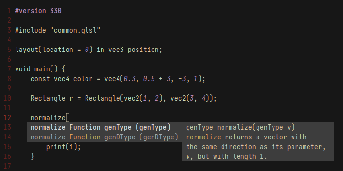

# `glsl_analyzer`

Language server for GLSL (OpenGL Shading Language).

- [Features](#features)
- [Installation](#installation)
- [Usage](#usage)


## Features

- Completion 
    - User-defined variables/functions.
    - Built-in types (e.g., `vecN`, `matNxM`, `texture2D`, etc.)
    - Built-in functions (e.g., `length`, `imageLoad`, `packUnorm4x8`)
    - Includes all [extensions](https://github.com/KhronosGroup/GLSL#extension-specifications-in-this-repository)
- Goto Definition
- Inline hover documentation for all builtin and extension functions/variables
- Support for `#include`
- Formatter




### In the pipeline

- Completion of fields
- Support for refactors (renaming)


## Installation

```sh
zig build install -Doptimize=ReleaseSafe --prefix ~/.local/
```

Tested using `zig 0.12.0-dev.629+1606717b5`.


## Usage

By default `glsl_analyzer` communicates over stdin/stdout, but you can
configure it to use a specific port using the following command:

```sh
glsl_analyzer --port <PORT>
```


